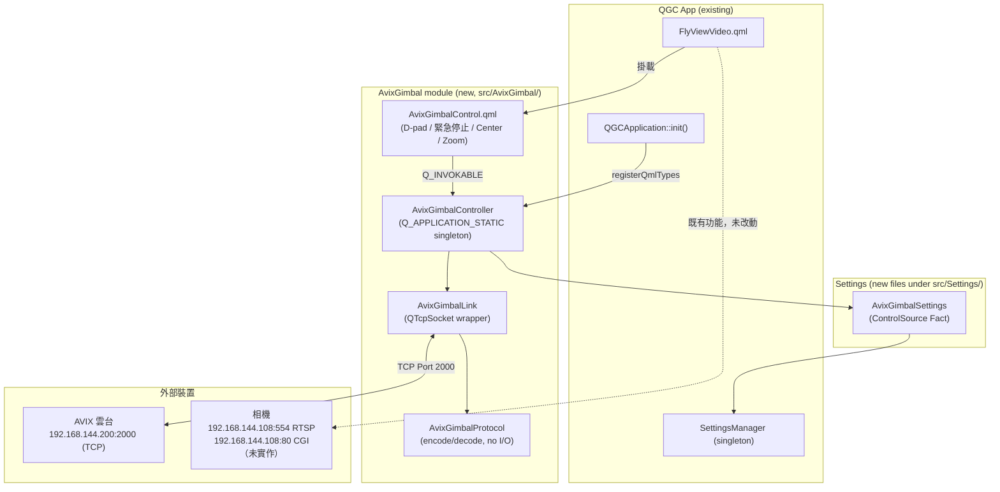

# AVIX 雲台整合 — 工作報告

日期：2026-07-20
範圍：QGroundControl v5.0.8，AVIX 雲台 TCP 控制協定整合（FR-1~FR-3）

---

## 1. 軟體拓樸



**關鍵設計決策：**

| 項目 | 決策 | 原因 |
|---|---|---|
| 常駐機制 | `Q_APPLICATION_STATIC` singleton | 這版 QGC（v5.0.8）沒有 `QGCToolbox`，改用這個 repo 目前的既有慣例（比照 `SettingsManager`） |
| 定位 | 不是 `Vehicle` 的一部分 | 雲台走獨立 TCP 協定、不講 MAVLink，跟任何飛控連線狀態無關 |
| 控制來源仲裁 | `ControlSource` enum（Native / MavlinkBridge） | 預留未來 MAVLink shim 介面，MVP 只實作 Native |
| Watchdog | Velocity 模式 400ms 逾時自動送停止 | 防止控制端斷線/當掉時雲台持續轉動 |

---

## 2. 原版 QGC 改了什麼

**新增檔案（全部關在獨立目錄，未動既有邏輯）：**

```
src/AvixGimbal/                       ← 全新目錄
  AvixGimbalProtocol.h/.cc            封包 encode/decode + checksum（純函式，已有 unit test）
  AvixGimbalLink.h/.cc                TCP 連線（含重連 timer）
  AvixGimbalController.h/.cc          singleton controller，ControlSource 仲裁 + watchdog
  AvixGimbalControl.qml               QML 控制面板
  CMakeLists.txt

src/Settings/
  AvixGimbalSettings.h/.cc            新增（比照既有 GimbalControllerSettings 掛法）
  AvixGimbal.SettingsGroup.json       新增

test/AvixGimbal/
  AvixGimbalProtocolTest.h/.cc        新增（8 個 test case）
  CMakeLists.txt
```

**修改既有檔案（都是單行註冊/掛載，沒有重構或改動旁邊邏輯）：**

| 檔案 | 改動內容 |
|---|---|
| `src/CMakeLists.txt` | 加 `add_subdirectory(AvixGimbal)`、`target_link_libraries` 加 `AvixGimbalModule` |
| `src/FlightDisplay/FlyViewVideo.qml` | 加一行 `AvixGimbalControl { anchors.fill: parent; z: 1 }`，緊接既有 `OnScreenGimbalController` 之後 |
| `src/Settings/SettingsManager.h`/`.cc` | 掛 `AvixGimbalSettings`（forward-declare + `Q_MOC_INCLUDE` + `Q_PROPERTY` + `init()` 內 `new`） |
| `src/Settings/CMakeLists.txt` | 加 `AvixGimbalSettings.cc`/`.h` 到 `target_sources` |
| `src/QGCApplication.cc` | 加一行 `AvixGimbalController::registerQmlTypes();`（QML 端要能用到這個 singleton 唯一的機制） |
| `qgroundcontrol.qrc` | 加一行掛 `AvixGimbal.SettingsGroup.json` 資源 |
| `test/CMakeLists.txt`、`test/UnitTestList.cc` | 註冊 `AvixGimbalProtocolTest` |

**沒有動過的地方**：既有 `src/Gimbal/GimbalController`（MAVLink Gimbal Protocol v2）、`src/Camera/`、`src/Comms/`、`src/GPS/` 完全沒有修改，兩套雲台邏輯（AVIX TCP vs MAVLink）互不相干。

---

## 3. 文件缺漏：Protocol Version（實機除錯過程中發現的最大落差）

原廠 ICD 文件（`gimbal_icd.txt`）對封包格式第 2 個 byte「Protocol Version」**只有欄位名稱，沒有定義實際數值**——原因是 ICD 原文 1.1.1 節與 4.2 節的「封包範例圖」是純截圖，沒有被轉成文字（PDF 轉文字擷取時遺漏）。

**造成的實際影響**：一開始假設這個欄位是 `0x00`，導致雲台**完全靜默忽略**我們送出的所有 FR-2/FR-3 指令——TCP 連線正常建立、checksum 也算得完全正確，但雲台端就是沒有任何反應，除錯過程中一度懷疑是連線層、checksum 範圍、甚至 ICD 提到的「Hand-Shaking required」是不是代表還需要額外的應用層交握。

**如何定位到問題**：用 Wireshark 直接抓封包分析——雲台自己主動送出的 `0xF0 Gimbal Status Return` 狀態封包，逐 byte 解出來後發現它自己用的 Protocol Version 是 `0x01`，改成這個值之後，雲台立刻正常回應移動與縮放指令。

**這件事的教訓**：ICD 文件本身有結構性缺漏（圖片內容未文字化），單靠讀文件無法補完，必須靠實機抓包反推。目前 `AvixGimbalProtocol.cc` 裡這個值已經改成 `0x01`，但**這仍然是從雲台單方面的封包觀察反推出來的，不是原廠白紙黑字確認過的規格**——如果雲台韌體之後更新，這個假設可能需要重新驗證。

**同一輪除錯順便確認的另一個假設**：Checksum 涵蓋範圍（是否含 `0xAB 0xCD` 兩個 sync byte）——已用同一份抓到的封包驗證，範圍是從 offset 0（含 sync byte）累加到 Data 結尾，跟我們的實作一致，這個假設是對的。

---

## 4. ICD 文件有提到、但目前尚未實作的功能

| Message / CGI | 功能 | 狀態 |
|---|---|---|
| `0x31` Follow Random Head | 雲台跟隨機頭開關 | 未實作，**已列入代辦**（見第5節，動工前需先確認姿態橋接缺口） |
| `0x33` Transfer to Specify Angle | 角度模式移動 | Controller/Protocol 有實作，UI 目前只有 `Center`（Yaw/Pitch=0）用到，沒有開放任意角度輸入 |
| `0x3A` Camera Control - Focus (Mode=1) | 對焦（自動/手動/遠近） | 未實作，目前只送 Mode=0（Zoom） |
| `0x3A` Camera Control - Rec (Mode=2) | 錄影開關（存在雲台自己的 SD 卡） | 未實作 |
| `0x3B` Camera Capture | 拍照（存在雲台自己的 SD 卡） | 未實作 |
| `0x50` Distance Measurement | 雷射測距開關 | 未實作 |
| `0xF0` Gimbal Status Return | 雲台狀態回報（10Hz，含 Roll/Pitch/Yaw/Zoom/DataFlag 等） | **只有收、沒有用**——封包有正確 decode，但欄位內容目前全部丟棄，UI 看不到雲台目前實際狀態 |
| `0xF1`/`0xF2` Gimbal Version | 查詢韌體版本/型號/SN | 未實作 |
| `0xC0`/`0xC1`/`0xC2` Control IP | 查詢/變更雲台控制 IP | 未實作，且 ICD 原文這幾個訊息的欄位表格本身也是空的 |
| CGI 全部（Port 80，FR-4/Phase 2） | 畫質設定、網路設定、AI 追蹤等 | 整個都還沒開始，需先解待確認事項 #4（Admin 認證） |

**明確排除、非缺口**（SRD 附錄A，刻意不做）：`0x60` GPS/姿態橋接、AI 追蹤（SetTracking/GetDetection）、熱像控制（0x3C/SetThermal.cgi）、SBUS。

---

## 5. 代辦事項

1. **跟隨機頭開關按鈕**（本次新增，見 CLAUDE.md 第7節）——動工前需先確認：目前沒有 UART/`0x60` 姿態橋接，雲台即使開啟跟隨機頭也收不到真實航向，功能上可能無法正常運作。**懷疑這也是「雲台在靜止平台上會自己飄動」的根本原因**——需要先解析 `0xF0` 的 DataFlag bit4（PTZ 模式）確認雲台目前是不是真的處在跟隨機頭模式。
2. 解析並利用 `0xF0` 狀態封包內容（尤其 DataFlag），用於上述診斷、也可以顯示在 UI 上讓使用者看到雲台目前實際姿態/焦段。
3. 待確認事項 #1（TCP 長時間連線穩定性/keep-alive）、#2（Sequence/0x01 ACK 配對機制）尚未解，目前只有基本重連 timer，長時間穩定性未經驗證。
4. FR-4（CGI 畫質設定）開工前需先解待確認事項 #4（`SetMultimedia.cgi` 的 Admin 認證是否與 RTSP 帳密共用）。
5. `custom/` 客製化建置架構、換品牌圖示、Android 版本——使用者已提出，優先度較低，待雲台核心功能（FR-2/FR-3 穩定性、跟隨機頭問題）處理完再排入。

---

## 附錄：已解決的問題（本輪除錯成果，避免重工）

- ✅ Checksum 涵蓋範圍：含 sync byte，從 offset 0 累加
- ✅ Protocol Version：`0x01`（非原假設的 `0x00`）
- ✅ `AvixGimbalLink` 解構順序 bug：`_socket` 解構時觸發 `disconnected` signal 重入已解構的 `_reconnectTimer`，造成 `0xC0000005` crash——已在解構函式明確 `_socket.disconnect(this)` 修正
- ✅ QML watchdog 交互 bug：D-pad 按住不放時因為沒有持續重送指令，被 400ms watchdog 誤判斷線自動停止——已加 200ms 重送 timer 修正
- ✅ QML z-order bug：面板一開始被下層的 `flyViewVideoMouseArea`（全螢幕 MouseArea）攔截點擊，加 `z: 1` 修正
